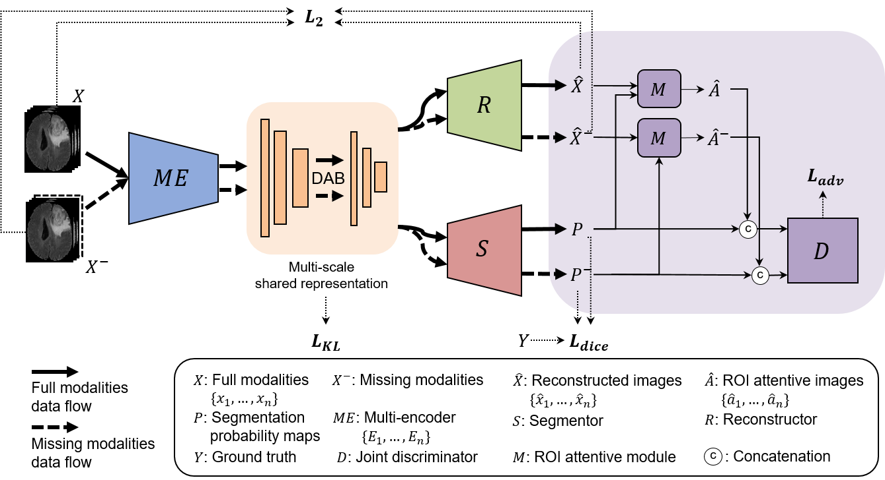

# ROI-Attentive-Heteromodal-Variational-Encoder-Decoder for Segmentation with Missing Modalities
Region-of-interest Attentive Heteromodal Variational Encoder-Decoder for Segmentation with Missing Modalities

text will be added



## Data Preparation

## Training
```
python train.py <model_name> --num_epochs 360 --crop_size 112 --train_batch 1 --valid_batch 5
```
## Evaluation
```
python test.py <model_name> <model_epoch> --crop_size 112 --valid_batch 12
```
